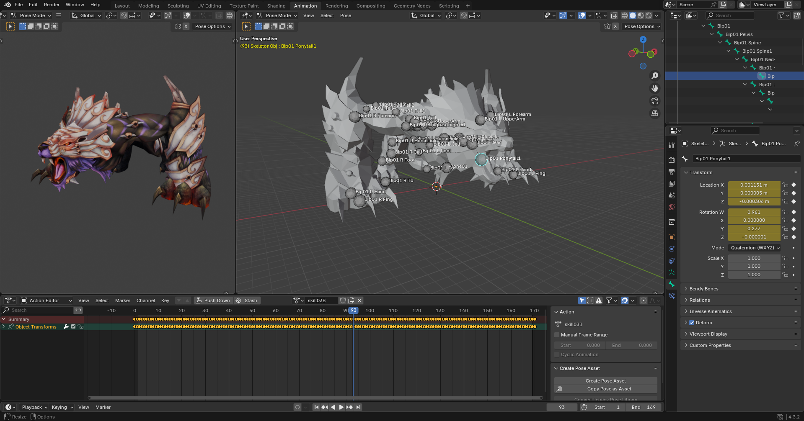

# Blender O3D Importer and Exporter

## Introduction

Unofficial Fly For Fun model file format (.o3d) file importer and exporter for Blender. This addon handles O3D files including their skeletons, animations, materials, and more. Progress can always be made to support additional features such as bone attachments, various FlyFF utilities, or otherwise useful additions. Contributions are welcome and encouraged, and give it a star if it's something you find useful!

## Installation

Simply download the .zip file from the release section, head into Blender > Edit > Preferences > Add-ons > Install from Disk, and select the .zip file (do not extract it).

## Contribution

If you have requests or suggestions, please create an issue. If you would like to contribute a feature or a fix, please start a pull request (and ideally link it to an issue).
